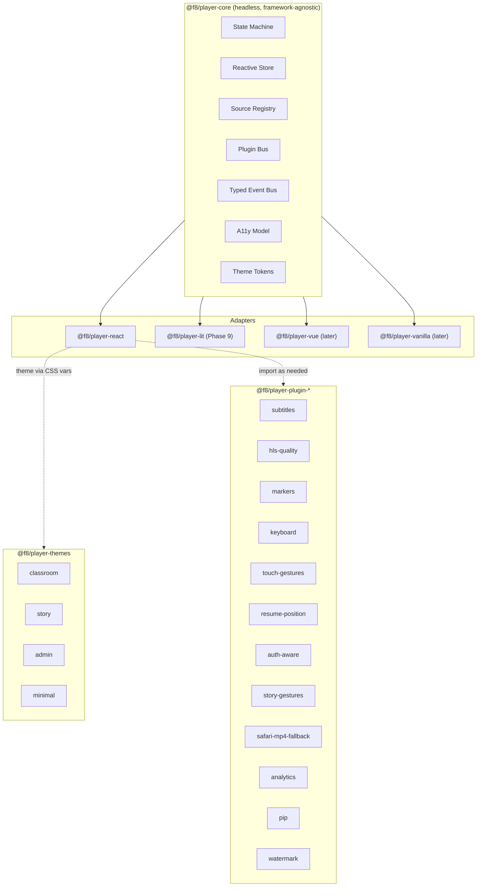
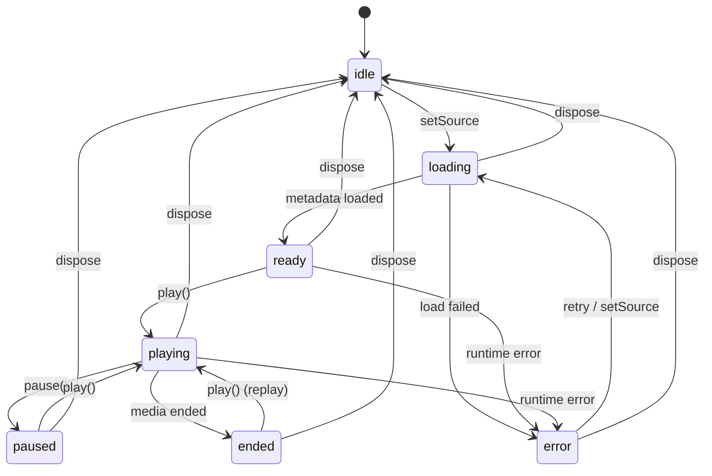

# Architecture

## High-level diagram



## State machine



Implementation sketch (Phase 1): a tiny xstate-free reducer keyed on
`(currentStatus, event)` that returns the next status and an array of side
effects. The store applies the side effects synchronously through the
`HTMLMediaElement` and broadcasts the new status via the event bus.

## Module layout

```
packages/core/
  src/
    index.ts              # public re-exports
    createPlayer.ts       # factory + lifecycle
    state/
      machine.ts          # status reducer
      store.ts            # reactive store
      selectors.ts        # memoized selectors
    sources/
      registry.ts
      native.ts           # always available
      hls.ts              # lazy import('hls.js')
      youtube.ts          # lazy load YouTube IFrame API
    events/
      bus.ts
      types.ts
    plugins/
      bus.ts
      definePlugin.ts
      host.ts
    a11y/
      announce.ts
      focusTrap.ts
    theme/
      tokens.ts
      apply.ts
    errors/
      registry.ts
      classify.ts
    util/
      time.ts             # parse "00:01:23" / format
      url.ts              # detectSourceType, looksLikeHls
      promise.ts
    internal/             # @internal — not part of the contract
  tests/
  vitest.config.ts
  package.json
  tsconfig.json
```

```
packages/react/
  src/
    index.ts
    Player.tsx            # one-liner
    Root.tsx              # provider
    Video.tsx
    Captions.tsx
    Controls/
      Bar.tsx
      PlayPause.tsx
      SeekBar.tsx
      Time.tsx
      Volume.tsx
      Quality.tsx
      PlaybackRate.tsx
      Captions.tsx
      Pip.tsx
      Fullscreen.tsx
    hooks/
      usePlayer.ts
      usePlayerState.ts
      usePlayerEvent.ts
    refs/
      handle.ts           # PlayerHandle imperative ref
```

```
packages/themes/
  src/
    classroom.css
    story.css
    admin.css
    minimal.css
    tokens/
      base.css
```

```
packages/plugin-<name>/
  src/
    index.ts              # default-exported PluginInstance factory
    impl.ts
  tests/
  package.json
  tsconfig.json
```

## Lazy loading

| Asset              | Strategy                                                                                                |
| ------------------ | ------------------------------------------------------------------------------------------------------- |
| `hls.js`           | Dynamic `import("hls.js")` on first HLS source attach. Cached on the source provider.                   |
| YouTube IFrame API | Inject `<script>` once per page, gated behind a Promise.                                                |
| Theme CSS          | Imported by the consumer (`import "@f8/player-themes/classroom.css"`). Bundlers tree-shake unused ones. |
| Plugins            | Always tree-shaken — only imported plugins ship.                                                        |

## Bundle budgets

| Package            | Target gzip | Hard CI fail |
| ------------------ | ----------- | ------------ |
| `@f8/player-core`  | <12 KB      | >15 KB       |
| `@f8/player-react` | <4 KB       | >5 KB        |
| Each plugin        | <2.5 KB     | >3 KB        |
| Each theme CSS     | <1.5 KB     | >2 KB        |

Enforcement: `size-limit` runs in CI per package and blocks the merge.

## A11y design

- Every `Player.Controls.*` primitive renders a real `<button>` with `aria-label`, `aria-pressed` (for toggles), and visible focus styles via theme tokens.
- The captions menu and the quality menu are real `<menu>` / `<ul role="menu">` with arrow-key navigation.
- A live-region (`aria-live="polite"`) announces state changes the user cannot see (e.g., quality auto-switched, subtitle on/off).
- Fullscreen traps focus within the player container and restores it on exit.

## Performance design

- Every state read in a hot path goes through a memoized selector.
- The event bus uses a `Set<Listener>` keyed by event name. No re-allocation per emit.
- `timeupdate` is throttled to a configurable interval (default 250 ms) so plugins do not flood listeners.
- The reactive store batches updates within a single microtask.

## Security design

- The player never inserts unsanitized user-controlled URLs into the DOM as `<script>` or `srcdoc`. Sources go through the registry which dispatches to the appropriate engine.
- Cookie / `withCredentials` is opt-in per source via either the source descriptor or the `auth-aware` plugin. The default is **off**, so consumers are explicit about who gets the user's session.
- HLS / YouTube SDKs are loaded from npm (bundled), not from third-party CDNs, eliminating drive-by injection.
